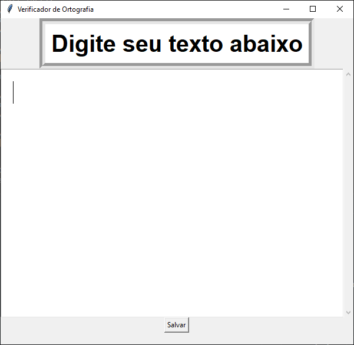
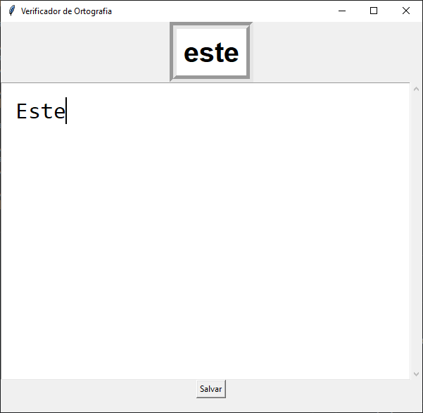
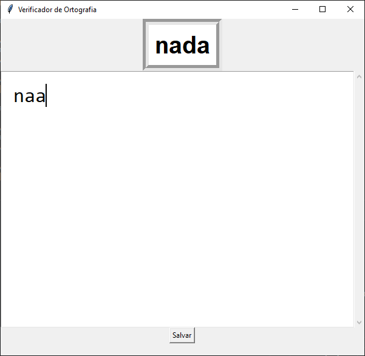

# Auto_Corretor

**Número da Lista**: 40 
**Conteúdo da Disciplina**: Programação Dinamica 

## Alunos
|Matrícula | Aluno |
| -- | -- |
| 16/0112028  |  André Goretti Motta |

## Sobre 
Este projeto tem como objetivo desenvolver um verificador ortográfico baseado no algoritmo de "Subsequência Comum Mais Longa" (LCS). Para isso, foi criada uma interface simples onde é possível inserir o texto e o verificador irá compará-lo palavra por palavra com uma base de dados resumida, garantindo assim a eficiência e agilidade da verificação ortográfica.

## Screenshots

## Instalação 
**Linguagem**: Python 

Basta instalar o TKinter:

>sudo apt install python3-tk

## Uso 

>python3 Main.py

